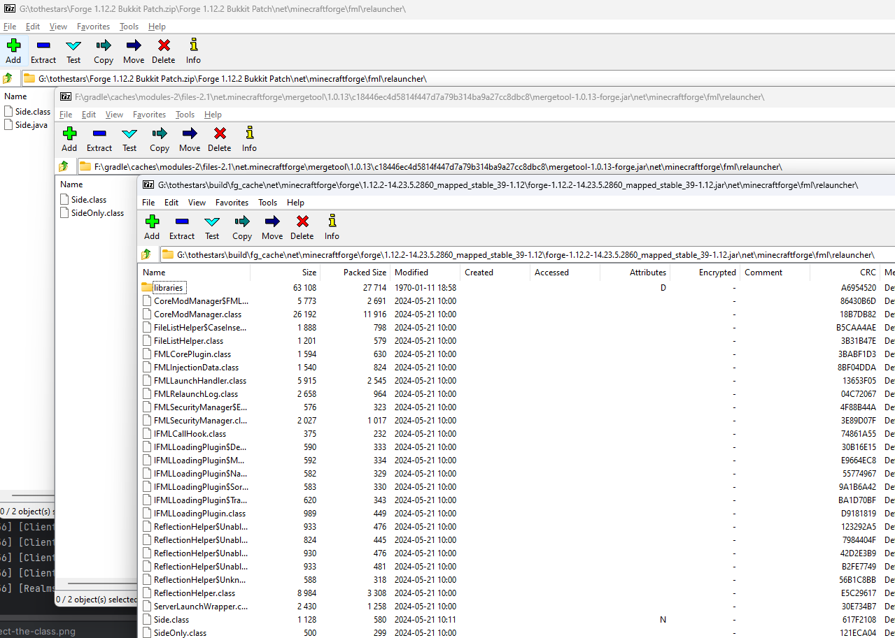
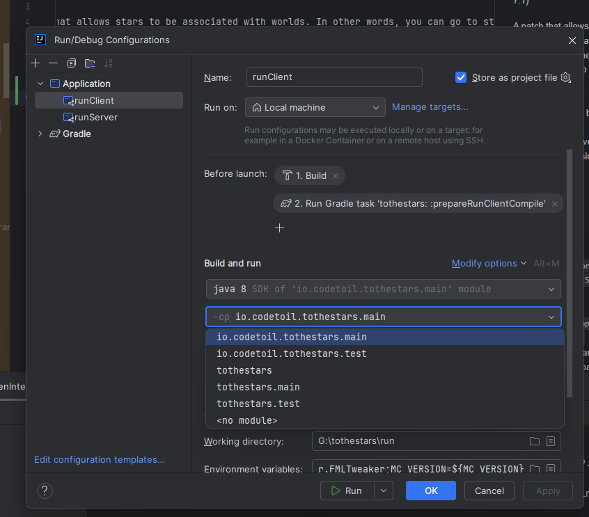

# ToTheStars
Requires [MixinBooter](https://www.curseforge.com/minecraft/mc-mods/mixin-booter "MixinBooter") (8.0 or higher does not work, for now use 7.1)

A patch that allows stars to be associated with worlds. In other words, you can go to stars. Does not include stars themselves, must be added separately.  [HaveASolTime](https://github.com/Codetoil/haveasoltime "HaveASolTime Github") gives an example for using the api.

Available on [CurseForge](https://www.curseforge.com/minecraft/mc-mods/tothestars "ToTheStars CurseForge") and [Modrinth](https://modrinth.com/mod/tothestars "ToTheStars Modrinth")

In order to get the development environment working, inject the `net.minecraftforge.fml.relauncher.Side` class into the `forge-1.12.2-14.23.5.2860_mapped_stable_39-1.12-recomp.jar`
and `mergetool-1.0.13-forge.jar` Jars, and change the classpath from `tothestars.main` to `io.codetoil.tothestars.main`

Injecting the class screenshot:

Selecting the classpath screenshot:
